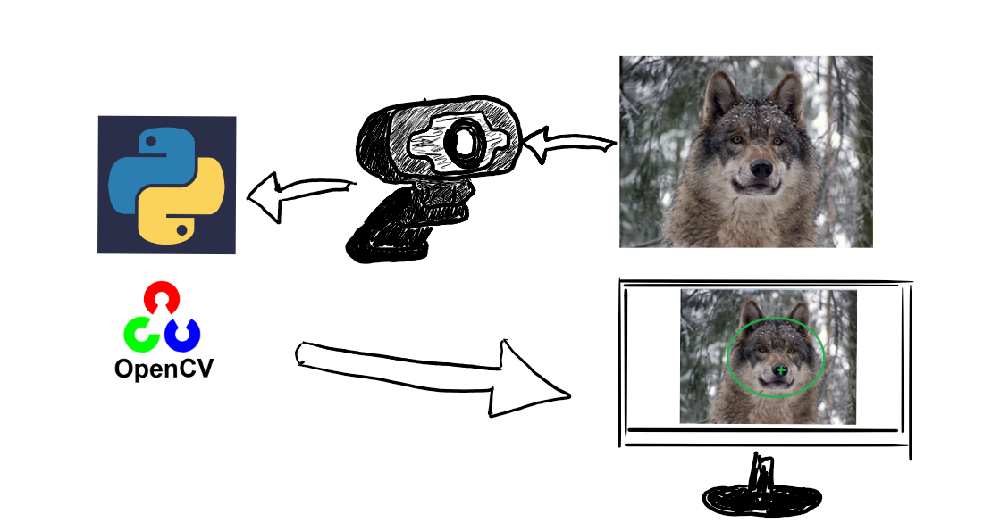
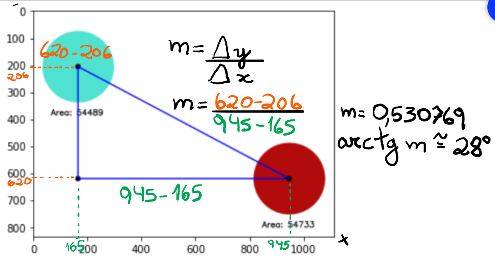
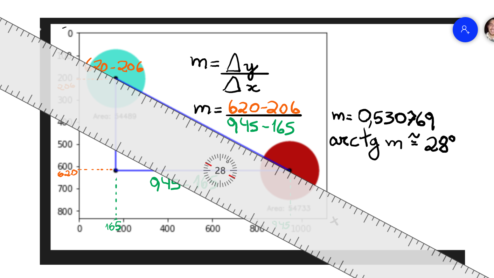

<h1>NAC5-IOT-CV2</h1>

<h3><b>Nome dos alunos:</h3>

Larissa Alves da Silva - RM 86351

Daniel Sanchez Melero - RM 85109

<h3>Turma:</h3>

2TDSG

<h3>Ano:</h3>

2021

## **Objetivo / descrição do Projeto**

O objetivo desse projeto é partir de uma imagem de referência, estabelecendo um filtro HSV, marcando os contornos, as áreas e o ângulo de inclinação da reta, retornando uma imagem resultante que encontre os maiores círculos da imagem inicial. Neste projeto, isso é aplicado tanto pra imagem quanto para vídeo. Para isso, é utilizada a biblioteca de visão computacional cv2 junto com numpy e matplotlib pyplot.

## **Diagrama do projeto**
 
 <h3>Arquitetura Geral</h3>

<h3>Cálculo do ângulo</h3>

<h3>Cálculo do ângulo com régua</h3>

## **Como usar **

Será necessário instalar o Python e o Jupyter Notebook. 

<ol>
    <li>Baixar o Python em <a style = "color: #34ebdb" href = "https://www.python.org/downloads/">https://www.python.org/downloads/</a></li>
    <li>Download Python 3.9.7.</li>
    <b>IMPORTANTE</b>: Ao instalar, marque a opção "Add Python 3.9 to PATH"
    <li>Instalar no terminal de comando: pip install notebook</li>
</ol>

* É possível utilizar as extensões do VSCode para trabalhar concomitantemente com .ipynb e .py.
   

Para clonar o repositório desse projeto:

    https://github.com/rm85109/IOT-NAC5
   
## Link de vídeo demonstração

Adicione o link para assistir ao vídeo do projeto funcionando.

    

### **Referências**

<ul>
    <li><a style ="color: #34ebdb" href="https://stackoverflow.com/questions/19222343/filling-contours-with-opencv-python">filling contours with opencv python</a></li>
    <li><a style ="color: #34ebdb" href="https://www.pyimagesearch.com/2021/01/19/opencv-bitwise-and-or-xor-and-not/">penCV Bitwise AND, OR, XOR, and NOT by Adrian Rosebrock on January 19, 2021</a></li>
</ul>
